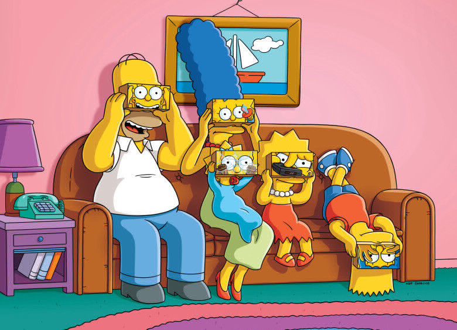
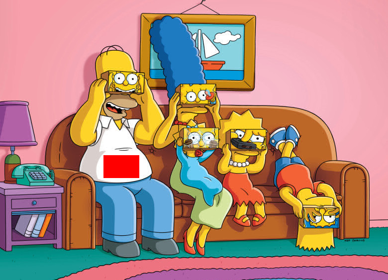
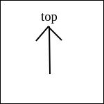
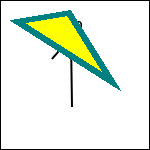
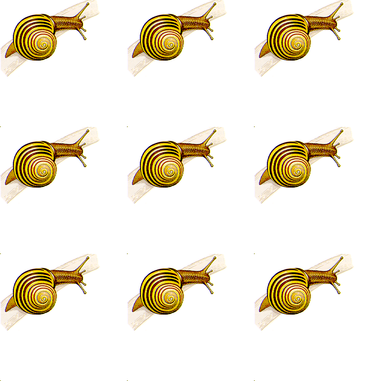
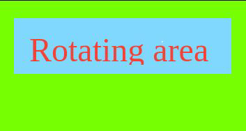
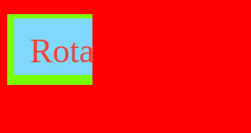

Общие сведения (CLI ver 1.0)
--------------
+ 24 бита на цвет
+ без сжатия
+ файл всегда соответствует формату BMP (но стоит помнить, что версий у формата несколько)
+ обратите внимание на выравнивание; мусорные данные, если их необходимо дописать в файл для выравнивания, должны быть нулями.
+ обратите внимание на порядок записи пикселей
+ все поля стандартных BMP заголовков в выходном файле должны иметь те же значения, что и во входном (разумеется кроме тех, которые должны быть изменены).

Программа реализовывает следующий функционал по обработке bmp-файла
-------------------------------------------------------------------
1. Рисование треугольника. Треугольник определяется:
    + Координатами его вершин 
    + Толщиной линий 
    + Цветом линий 
    + Треугольник может быть залит или нет 
    + Цветом которым он залит, если пользователем выбран залитый 

    
      Пример
      ./bmpp --find_rect -m 255,255,255 -f 255,0,0 -n Examples/simpsonsvr_rect.bmp --file Examples/simpsonsvr.bmp
      
_file: simpsonsvr.bmp_

_file: simpsonsvr_rect.bmp_

2. Находит самый большой прямоугольник заданного цвета и перекрашивает его в другой цвет. Функционал определяется:
   + Цветом, прямоугольник которого надо найти
   + Цветом, в который надо его перекрасить

      Пример
      ./bmpp --triangle -a 10,20 -b 120,90 -c 70,10 -w 5 --color 0,128,128 --fill 255,255,0 -n Examples/t2_triangle.bmp --file Examples/t2.bmp

_file: t2.bmp_

_file: t2_triangle.bmp_

3. Создать коллаж размера N\*M из одного либо нескольких фото -- на выбор студента (либо оба варианта по желанию). 
   + В случае с одним изображением коллаж представляет собой это же самое изображение повторяющееся N\*M раз.
   + Количество изображений по “оси” Y
   + Количество изображений по “оси” X
   + Перечень изображений (если выбрана усложненная версия задания)

      Пример
      ./bmpp --collage -x 3 -y 3 -n Examples/snail_collage.bmp --file Examples/snail.bmp
     
_file: snail.bmp_

_file: snail_collage.bmp_

4. Закрашивает заданным цветом часть изображения вне указанной прямоугольной области. Область определяется: 
   + Координатами левого верхнего угла
   + Высотой
   + Шириной

      Пример
      ./bmpp --fill_outer -x 10,20 -w 120 -h 100 -c 255,0,0 -n Examples/r1_fill_outer.bmp --file Examples/r1.bmp 

_file: r1.bmp_

_file: r1_fill_outer.bmp_

